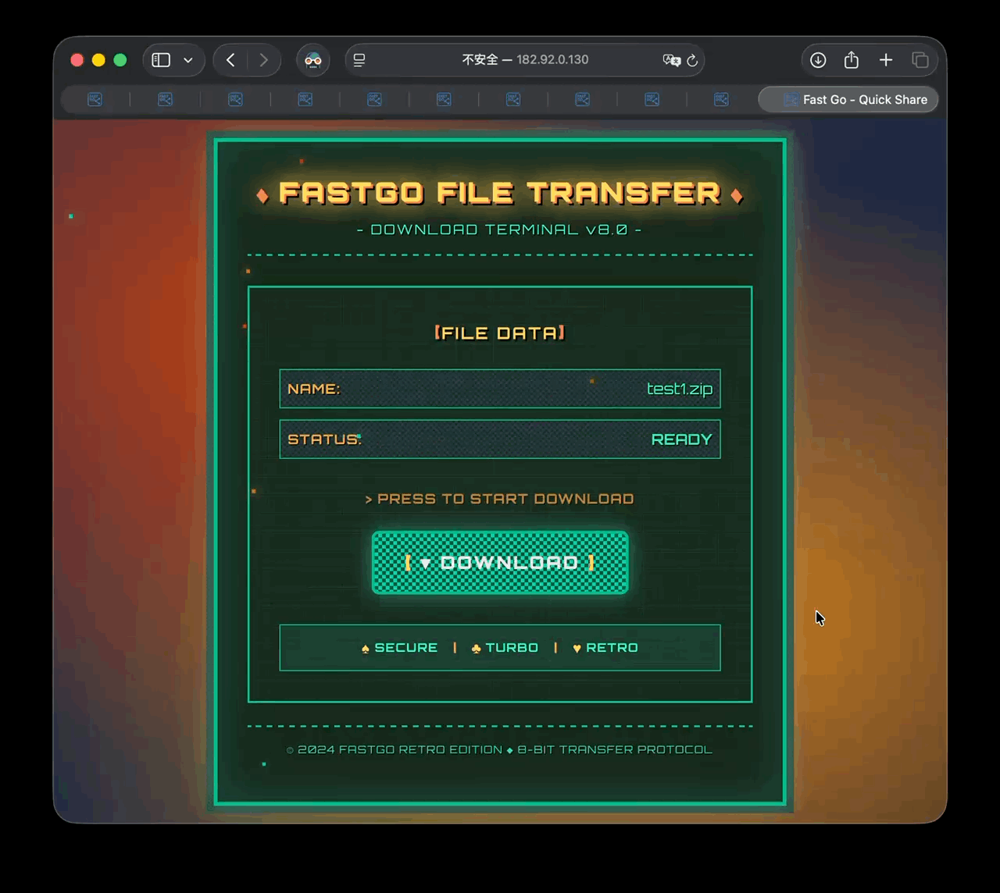
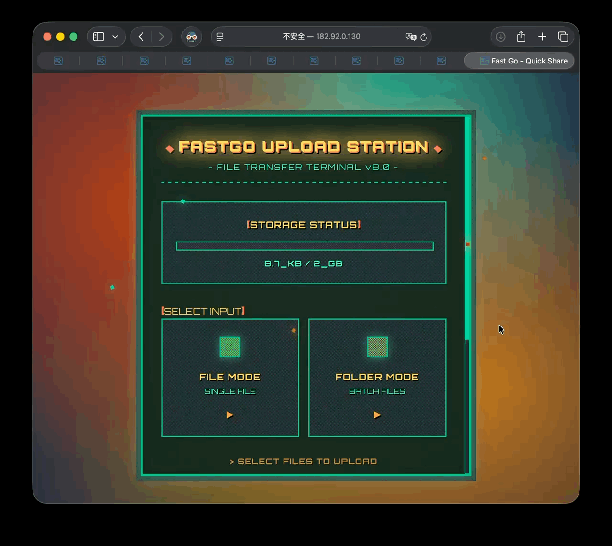

<div align="center">


# FastGo - Revolutionary File Sharing System

**🌍 Language / 语言选择**
- [English](README.md) (Current)  
- [中文简体](README_zh.md)

[](https://github.com/ailuntz/fastgo)
[](https://marketplace.visualstudio.com/items?itemName=ailuntz.fastgo)
[](https://hub.docker.com/u/ailuntz)

[](https://github.com/ailuntz/fastgo/stargazers)
[](https://github.com/ailuntz/fastgo/network/members)
[](https://github.com/ailuntz/fastgo/issues)
[](https://github.com/ailuntz/fastgo/blob/main/LICENSE)
[](https://github.com/ailuntz/fastgo/releases)

</div>

FastGo is a revolutionary file sharing solution designed specifically for developers. **No login required, direct download links, say goodbye to cloud storage speed limits!** Simply right-click in VSCode Explorer to instantly generate exclusive sharing links, making file sharing unprecedentedly simple and efficient.

🚀 **Core Advantages**
- ⚡ **Lightning Fast**: No registration required, click to download, unlimited speed transfer
- 🔐 **Private Deployment**: Complete control over data security, no third-party servers involved  
- 🎨 **Beautiful Interface**: 11 professional templates, each sharing link is a visual feast
- 🔧 **Developer Friendly**: Deep VSCode integration, containerized deployment, one-click startup

## 🚀 Quick Deployment

### Prerequisites
- VSCode with FastGo extension installed
- A public server with Docker installed
- A local computer with Docker installed

### 1. Server Side - Pull and Run Docker Container

Run on your public IP server:

```bash
docker run --restart=always --network host -d --name fastgo_s \
  -e TOKEN=fastgo \
  ailuntz/fastgo_s:latest
```

**Environment Variables:**
- `TOKEN`: Authentication token, must match the client (default: fastgo)

### 2. Client Side - Pull and Run Docker Container

Run on your local machine:

**Linux/macOS:**
```bash
docker run -d --restart=always \
  -v /path/to/share:/app/fastgo \
  -e SERVER_ADDR=your.server.ip \
  -e REMOTE_PORT=8409 \
  -e TOKEN=fastgo \
  --name fastgo_c \
  ailuntz/fastgo_c:latest
```

**Windows:**
```bash
docker run -d --restart=always \
  -v C:\path\to\share:/app/fastgo \
  -e SERVER_ADDR=your.server.ip \
  -e REMOTE_PORT=8409 \
  -e TOKEN=fastgo \
  --name fastgo_c \
  ailuntz/fastgo_c:latest
```

**Important Parameters:**
- `-v` mount parameter: Path used for sharing and uploading, plugin will use this path as prefix
  - Linux/macOS: `/path/to/share:/app/fastgo`
  - Windows: `C:\path\to\share:/app/fastgo`
- `SERVER_ADDR`: Replace with your server IP address or domain name
- `REMOTE_PORT`: Public access port (default 8409)
- `TOKEN`: Authentication token, must match server side (default: fastgo)

### 3. Download FastGo Extension from VSCode
```
Search and install FastGo extension in VSCode
```

### 4. Configure FastGo Extension

After installation, configure two key parameters (prompted on first use):

1. **Server Address (fastgo.baseUrl)**
   - Your server address or domain name
   - Format: `http://your.server.ip:8409`
   - Example: `182.98.98.101:8409`

2. **Path Prefix (fastgo.pathPrefix)**  
   - Local path prefix mounted to Docker container
   - Linux/macOS example: `/path/to/share`
   - Windows example: `C:\path\to\share`
   - Must match the local path in Docker mount command

**Important Note**: Only folders mounted to Docker container will show sharing and upload options when right-clicking in VSCode Explorer.

## 📖 Usage Guide

### Creating Download Links

1. Right-click on file or folder in VSCode Explorer
2. Select "Create Share Link"
3. Configure parameters:
   - **Max Downloads**: Limit download count (default: 3)
   - **Expiry Time**: Link validity period (default: 24 hours)
   - **Template Style**: Choose interface template
4. Get sharing link for others to download via browser


**Template Showcase** - System provides multiple beautiful download page templates:



### Creating Upload Links

1. Right-click on folder in VSCode Explorer
2. Select "Create Upload Link"
3. Configure parameters:
   - **Expiry Time**: Link validity period (default: 24 hours)
   - **Storage Capacity**: Maximum upload capacity (default: 2GB)
   - **Template Style**: Choose interface template
4. Get upload link for others to upload files via browser


**Template Showcase** - System provides multiple beautiful upload page templates:



## ✨ Features

### VSCode Extension Features
- 📂 **Explorer Integration**: Right-click files/folders in Explorer to create sharing links directly
- 🔗 **Download Link Generation**: Create temporary download links for files or folders (folders auto-packaged as ZIP)
- 📤 **Upload Link Generation**: Create upload links for directories, allowing others to upload files
- ⚙️ **Flexible Configuration**: Support server address, path mapping and other configurations
- 🎨 **Multiple Templates**: 11 beautiful interface templates to choose from
- 🌍 **Multi-language Support**: Support Chinese and English interfaces

### Web Features
- 🎯 **Intuitive Interface**: Each sharing link has independent beautiful download/upload pages
- ⚡ **Chunked Upload**: Support large file chunked upload and resume transfer
- 📊 **Real-time Progress**: Upload and download progress displayed in real-time
- 🔒 **Security Control**: Support download count limits and expiration time control
- 💾 **Storage Management**: Upload links support storage capacity limits

## 🏗️ System Architecture

```
┌─────────────────┐    ┌──────────────────┐    ┌─────────────────┐
│   VSCode Plugin │────│   fastgo-c Client  │────│  fastgo-s Server │
│   (Local Usage) │    │   (Local Container) │    │  (Public Server)  │
└─────────────────┘    └──────────────────┘    └─────────────────┘
```

- **fastgo-s (Server)**: Runs on public IP server as reverse proxy server
- **fastgo-c (Client)**: Runs locally, contains Web backend, frontend interface and reverse proxy client
- **VSCode Plugin**: Provides convenient right-click menu operations, communicates with fastgo-c

## 🎨 Template Styles

The system provides 11 beautiful interface templates:

| Template ID | Template Name | Style Description |
|-------------|---------------|-------------------|
| 0 | Default | Simple default style |
| 1 | Mihoyo | Mihoyo gaming style |
| 2 | Steam | Steam platform style |
| 3 | Hacker | Hacker terminal style |
| 4 | Apple | Apple design style |
| 5 | Cyberpunk | Cyberpunk style |
| 6 | Galaxy | Starry galaxy style |
| 7 | Matrix | Matrix movie style |
| 8 | Neon | Neon light style |
| 9 | Corporate | Corporate business style |
| 10 | Retro | Retro nostalgic style |

## 🛠️ Development & Debugging

### Frontend Development

```bash
cd fastgo
npm install
npm run dev  # Development server runs on http://localhost:4000
npm run build  # Build production version
```

### Backend Development

```bash
cd app
pip install -r requirements.txt
python fastapi_app.py  # Development server runs on http://localhost:8080
```

### VSCode Extension Development

```bash
cd vscode_extension/fastgo
npm install
npm run compile  # Compile TypeScript
npm run watch   # Watch file changes and auto-compile
```

## 🔧 Tech Stack

- **Frontend**: Vue 3 + TypeScript + Vite
- **Backend**: FastAPI + Python
- **Reverse Proxy**: FRP (Fast Reverse Proxy)
- **Containerization**: Docker + Docker Compose
- **VSCode Extension**: TypeScript + VSCode Extension API

## 📦 Project Structure

```
├── app/                    # Backend code
│   ├── fastapi_app.py     # FastAPI main application
│   ├── storage.py         # Storage management
│   ├── config.py         # Configuration file
│   └── utils.py          # Utility functions
├── fastgo/               # Frontend code
│   ├── src/
│   │   ├── components/   # Vue components (including various templates)
│   │   ├── pages/       # Page components
│   │   └── api/         # API interfaces
│   └── dist/           # Build output
├── vscode_extension/     # VSCode extension
│   └── fastgo/
│       ├── src/
│       │   ├── extension.ts  # Extension main logic
│       │   └── i18n/        # Internationalization support
│       └── package.json     # Extension configuration
├── Dockerfile.fastgo-c   # Client container
├── Dockerfile.fastgo-s   # Server container
├── fastgo-c.toml.template        # FRP client configuration
├── fastgo-s.toml        # FRP server configuration
└── nginx.conf           # Nginx configuration
```

## 🔒 Security Features

- **Access Control**: All sharing links have unique tokens, cannot be enumerated
- **Time Limits**: Support link expiration time settings
- **Count Limits**: Download links can limit maximum download count
- **Capacity Limits**: Upload links can limit maximum storage capacity
- **Path Validation**: Strict path validation to prevent directory traversal attacks

## 📋 TODO

- [ ] Add file preview functionality
- [ ] Support batch operations
- [ ] Add access statistics
- [ ] Support custom domains
- [ ] Add user authentication system

## 🤝 Contributing

Welcome to submit Issues and Pull Requests to improve the project!

## 📊 Star History

[](https://star-history.com/#ailuntz/fastgo&Date)

## 📄 License

This project is licensed under the MIT License.